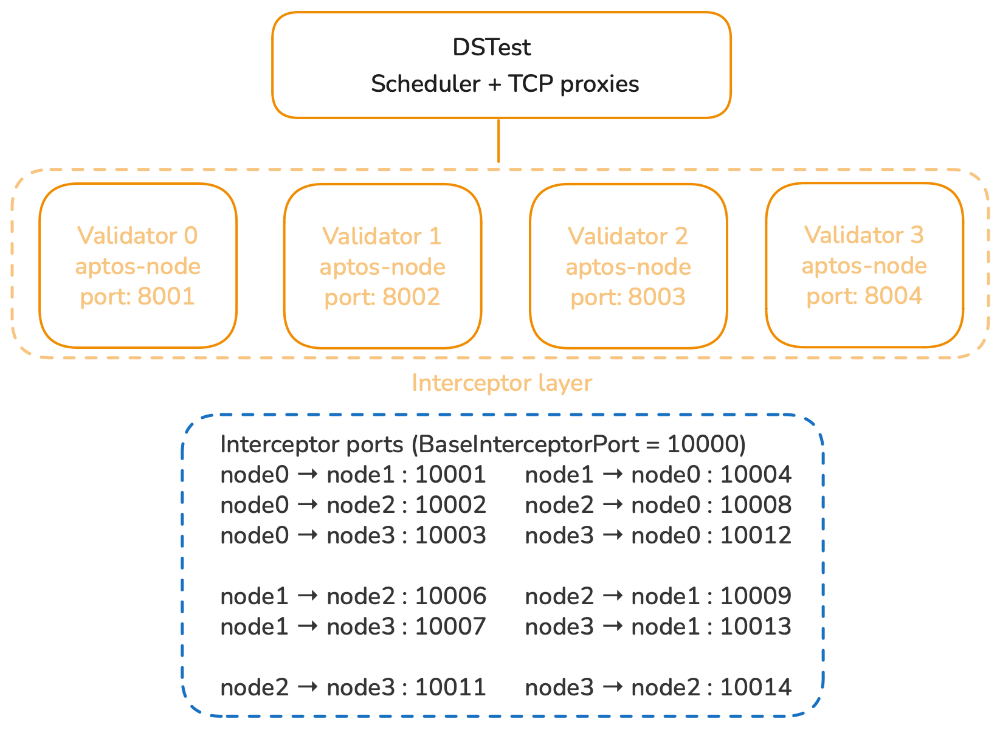

# Aptos n-nodes local network via DSTest

This directory contains the scripts, configs and log tooling required to run an Aptos validator cluster under DSTest’s TCP interception framework.

## What This Setup Provides

- Multi-node Aptos validator cluster  
- Execution via DSTest scheduler  
- Full control over network message ordering  
- Automatic log collection per node and per run  
- Post-processing script to extract consensus events

## Directory Overview

`dstest/aptos`

| File | Purpose |
|------|--------|
| `aptos_server.sh` | Starts a validator (called by DSTest per replica) |
| `aptos_clean.sh` | Stops nodes and clears runtime state |
| `aptos_prepare_localnet.sh` | Generates keys, genesis, waypoint |
| `aptos_make_node_configs.sh` | Builds per-node `node.yaml` |
| `aptos_update_seeds.py` | Injects validator seed peers |
| `configs/aptos.yml` | dsTest experiment configuration |
| `filter_consensus_logs.py` | Extracts filtered consensus events |

Output directory: `dstest/aptos`. Each run is indexed by a timestamp. 

## Execution Pipeline

We provide a Makefile to easily run the validator cluster and intercept the network messages.

In short, run `make all` from `dstest` directory root in order to execute the whole pipeline.

1. Build binaries (aptos-node, CLI, dsTest)  
2. Generate genesis + keys  
3. Create node configs  
4. Run DSTest experiment (config)
5. Collect logs per node  
6. Filter logs to consensus events  

## Example 4-nodes local network



Each interceptor is a transparent TCP proxy inserted by DSTest.

All validator traffic flows through these proxies, enabling message scheduling and fault injection.

Without network interception:
```
validator A -> validator B
(tcp)          (tcp)
```

With DSTest:
```
validator A -> tcp interceptor(A->B) -> validator B
validator B -> tcp interceptor(B->A) -> validator A
```

## Port architecture

For any node wih index i in the local network consisting of `NUM_REPLICAS` replica nodes:

| Service | Port Pattern |
|---------|-------------|
| Base validator port `BASE_PORT` | 8000
| Interceptor port `BaseInterceptorPort` | 10000
| Validator network `VAL_LISTEN_PORT` | BaseReplicaPort + i + 1 (e.g. 8001, 8002, 8003, 8004) |
| TCP interceptors | `10000 + sender_node_index * NUM_REPLICAS + receiver_node_index` |
| API port | `BASE_PORT + i * 10` |
| Inspection service (warp port) | `BASE_PORT + i * 10 + 6` |
| Admin service | `BASE_PORT + i * 10 + 7` |
| Backup service | `BASE_PORT + i * 10 + 8` |

**Validator listen address**: `/ip4/0.0.0.0/tcp/VAL_LISTEN_PORT` e.g. `/ip4/0.0.0.0/tcp/8001`

**Noise protocol**: Nodes connect via `/ip4/127.0.0.1/tcp/<port>/noise-ik/<pubkey>/handshake/0`

## Key Design Choices

### Validator peering via `seeds`
Using `seeds` (not `seed_addrs`) ensures peers are recognized as validators, allowing consensus to form.

### Deterministic ports
All ports are computed from a node's index to avoid collisions and simplify debugging.

### Timestamped runs
Each execution writes to a unique directory for reproducibility and comparison.

## Creating the local network details

`make genesis` (`aptos_prepare_localnet.sh`) : produce the chain's genesis state and per-node keys.

`make node-configs` (`aptos_make_node_configs.sh`) : create per-node runnable directories: `node.yaml` and local `genesis/` copies.

```
/tmp/aptos-dstest/
└── genesis/                                        # Chain-global artifacts (shared by all nodes)
    ├── genesis.blob                                # Genesis state (must match across all nodes)
    ├── waypoint.txt                                # Trusted checkpoint for bootstrapping
    ├── framework.mrb                               # Move framework bundle used for genesis
    ├── layout.yaml              
    ├── n0_keys/
    │   ├── validator-identity.yaml
    │   └── validator-full-node-identity.yaml
    ├── n1_keys/
    │   └── ...
    ├── n2_keys/
    │   └── ...
    ├── n3_keys/
    │   └── ...
    ├── n0/
    │   ├── operator.yaml             # On-chain account, allowed to run the validator and update networking info
    │   └── owner.yaml                # Stake owner identity
    ├── n1/
    │   └── ...
    ├── n2/
    │   └── ...
    ├── n3/
    │   └── ...
    └── nodes/                             # Per-node runnable directories
        ├── v0/
        │   ├── node.yaml                  # Final runtime config for node0 (ports/paths/seeds)
        │   ├── data/                      # Runtime DBs written by aptos-node
        │   └── genesis/                   # Local copies for self-contained startup
        │       ├── genesis.blob
        │       ├── waypoint.txt
        │       ├── validator-identity.yaml
        │       └── validator-full-node-identity.yaml
        │
        ├── v1/
        ├── v2/
        └── v3/
```

| File | Meaning |
|---------|-------------|
| `framework.mrb` | Compiled Move framework bytecode bundle used by the genesis generator. Everyone must use the same framework for a consistent chain start.
| `layout.yaml` | Defines the genesis layout (which accounts exist, initial validator set composition, and global chain parameters used to build `genesis.blob`).
| `genesis.blob` | The canonical chain genesis state. All nodes must load the exact same genesis or they’re not on the same chain.
| `waypoint.txt` | A checkpoint hash that nodes use to trust the starting state. Also needed by safety rules so consensus doesn’t accept nonsense chain history.
| `n{i}_keys/validator-identity.yaml` | Each validator’s identity + keys (network + consensus identity material). (unique per node)
| `node.yaml` | Defines the runtime configuration of a single node (networking ports, identity keys, storage paths, and consensus settings used by aptos-node at startup).

***Note***
The `owner.yaml` and `operator.yaml` files are generated during the Aptos genesis workflow to model the on-chain governance identities of each validator. They are not consumed by `aptos-node` at runtime in this DSTest setup, which instead relies on `validator-identity.yaml` plus the generated `node.yaml` for networking and consensus configuration.

#### Overwrite peer discovery info
`make seeds` (`aptos_update_seeds.py`): overwrite the peer discovery info in each `node.yaml` so nodes dial DSTest interceptors and recognize peers as Validators.

This modifies:
```
/tmp/aptos-dstest/nodes/v*/node.yaml
```

Specifically, updates `validator_network.seeds` with entries like:
```
seeds:
  <peer_account_address>:
    addresses:
      - /ip4/127.0.0.1/tcp/<interceptor_port>/noise-ik/<pubkey>/handshake/0
    keys:
      - <pubkey>
    role: Validator

e.g.: 
769bca6305bb3d5d708f650ad46cc26afb3a6c518040ecfa1fa9d6d5976ca98b:
      addresses:
      - /ip4/127.0.0.1/tcp/10003/noise-ik/0xad63f9fc5edbf2ab8e4960984180117e28cd21f49fdfe7cf05a8ce73b1779c0a/handshake/0
      keys:
      - '0xad63f9fc5edbf2ab8e4960984180117e28cd21f49fdfe7cf05a8ce73b1779c0a'
      role: Validator
```

This is crucial since:
- Nodes do not connect directly to 8001/8002/...
- They connect to interceptors at 10000+... so DSTest can manipulate traffic.
- Using seeds (not seed_addrs) is how we preserve role (Validator) and don’t accidentally classify peers as Validator Full Nodes (VFNs), which are nodes that do not participate in consensus (do not vote/propose).

#### Run

`make run` : DSTest uses `aptos.yaml` config file to spawn the replicas and write run logs.

It creates per run: 
```
output/aptos/<RUN_ID>/
└── <testname>_<schedtype>_<iteration>/
    ├── stdout_0.log
    ├── stderr_0.log
    ├── stdout_1.log
    ├── ...
    └── ...
```

#### Filtering logs

`make filter-logs` : postprocess DSTest logs into relevant consensus traces.

It creates inside each scheduler run dir the following:
```
output/aptos/<RUN_ID>/<run_subdir>/
└── filtered/
    ├── node0.log
    ├── node1.log
    ├── node2.log
    ├── node3.log
    ├── all_nodes.log
    ├── node0.jsonl
    ├── ...
    └── all_nodes.jsonl
```

